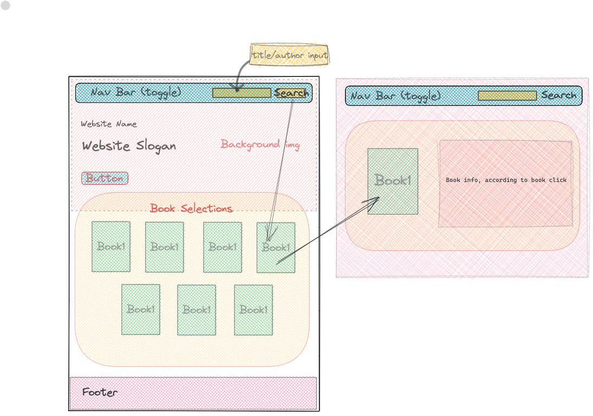

# Frontend Project: anotherRead 📖

> This project is to create a front-end website utilizing public APIs. The API used to create "anotherRead" is: [NYTimes Book API](https://developer.nytimes.com/). 
>
><strong>Abstract:</strong><em> "anotherRead" is a website making suggestion for readers with weekly updated list rendered from the top-selling list of fiction in America, to help viewers making book selections for their next purchase;</em>

## File Structure
```
|- anotherRead-frontend-project/
    |- index.html
    |- style.css
    |- script.js
    |- image
        |- background.jpeg
        |- anotherRead-mockup.png
    |- book.css
    |- page-0
        |- book.html
        |- book.js
    ...
    |- page-14
        |- book.html
        |- book.js
```
## UI Mockup Design: 



## Feature Overview:
- User can view the landing page with the top 15 best-selling fiction books of the NYTimes being rendered;
- User can search for book title/author, which are being displayed on the landing page, in the search bar;
- User can click on each book image being displayed on landing page and will be taken to the detail page of the book clicked;
- User can click on the logo or Home tab on Navigation Bar to be back to the landing page;

## Endpoint Usage:
- /lists/current/hardcover-fiction.json: 15 best-selling titles of the NYTimes in the fiction category updated weekly;

## Installation: 
- Clone this repo;
- Run


## Technologies:
Project is created with:
* HTML
* CSS
* JavaScript
